# Shape 完整设计与实施规划

| 属性 | 值 |
| --- | --- |
| 版本 | v0.5-draft |
| 状态 | 可用于立项；核心模型建议冻结前先完成 M0 验证 |
| 快照日期 | 2026-08-11 |
| 目标读者 | 产品、设计、桌面端、媒体内核、AI Runtime 与外部执行器开发者 |
| 首个桌面产品切片 | Image + Text + preset-only Speech Candidate/试听；完整 Audio 编辑仍后置 |
| 核心定义 | Shape 是一个把意图逐步塑造成可接受作品的 AI-native creative environment |

> 本文把早期 Shape 概念收敛为一套可实现、可验证、可演进的方案。它明确区分产品心智模型、创作文档模型、执行系统和外部生态，避免把 AI pipeline、媒体内核或第三方软件的内部结构泄漏成 Shape 的用户界面。

---

## 0. 执行摘要

Shape 的产品核心不是“用聊天控制编辑器”，也不是“把所有创作软件装进一个窗口”，而是下面这个持续循环：

```text
观察当前作品
→ 说明要保留什么
→ 说明要改变什么
→ 探索若干候选
→ 接受一个新状态
→ 继续、分支或发布
```

本方案做出以下关键决策：

1. **Scene Operator Graph 是每个 Scene 的主视图。**它以纯输入 Source、创作语义 Operator、命名 Output 为节点；Artifact Revision 通过类型化端口流动，而不是把所有东西都伪装成同一种节点。
2. **Artifact 是稳定的创作对象身份；Artifact Revision 是不可变的已接受状态；Artifact Content 保存其内部图层、片段、轨道或对象结构。**
3. **Transformation 只表达创作意义；Execution Plan/Receipt 记录系统实际怎样完成。两者不可混为一个对象。**
4. **Constraint 成为一等对象。**用户不仅说“改变什么”，还要能明确“人物、姿势、节奏、文字或构图不能变”。
5. **Variant 默认属于 Exploration，不全部进入主图。**只有被接受、固定或用于后续分支的候选才晋升为 Artifact Revision，防止 Graph 爆炸。
6. **Shape 自己拥有 Creative Model、交互、编排、项目依赖和来源追踪；Infer Runtime 只拥有推理准入、路由、资源和 Job/Attempt，不成为 Shape 的 Agent 或工作流引擎。**
7. **Shadow/Echo 是现实锚定系统。**Shape 只读引用其源资产并生成 Shape-owned 派生物；反向写入必须是显式“发布派生资产”，不能静默改写原记录。
8. **外部软件按三种方式接入：库级内核、受控无头执行器、显式往返编辑。**不能因为某软件有命令行就把它伪装成稳定、可嵌入的实时 Workspace。
9. **M0/M1 桌面交互仍以 Image + Text 为主，但已有一条窄 Audio 纵切。**preset-only speech
   已验证类型化 Source → Operator → Output、跨 Artifact 接受、来源追踪和所选 WAV 的本地试听；
   录音、波形编辑、Voice Reference、transform/generate 仍按后续媒体阶段加入。Video、3D
   不提前进入首个桌面切片。
10. **用户可以操作创作级 Operator，但不操作原子工具或物理执行步骤。**`Image Editing`、`Writing`、`Composite` 是 Scene 节点；Crop、Resize、Rewrite 是节点内部方法；model、sampler、CFG、checkpoint、Infer Job 或 ComfyUI 节点属于折叠的 Execution Graph。

一句面向用户的定义：

> **Shape is where you preserve what matters, change what you intend, and keep every accepted possibility.**

一句面向架构的定义：

> **Shape is a creative environment that composes typed Sources, creative Operators and named Outputs into versioned Scenes, while preserving immutable artifact revisions and delegating physical execution to deterministic engines, AI runtimes and external creative tools.**

---

## 1. 项目目标、非目标与成功标准

### 1.1 产品目标

Shape 要解决五个问题：

1. 人可以直接从“我想得到什么变化”出发，而不必先知道应该使用哪个工具或模型。
2. 每次被接受的创作状态都可以观察、比较、引用、回退、分支和继续加工。
3. 确定性编辑、生成式 AI、Shadow/Echo、云服务和外部软件可以参与同一项目，但保留真实差异。
4. 跨媒体、跨项目的作品可以通过稳定接口组合，而不是靠反复导出文件和手工替换。
5. 当模型、执行器或外部服务消失时，已经接受的作品仍然可打开、查看和导出；只是某些历史操作不能重算。

### 1.2 明确非目标

首个可用版本不追求：

- 完整替代 Photoshop、Krita、Premiere、Kdenlive、DaVinci Resolve、Blender 或 DAW；
- 向普通用户暴露节点式物理模型/执行器 workflow；创作级 Operator Graph 是产品主界面；
- 成为模型下载器、模型市场或训练平台；
- 在一个版本内同时完成图像、音频、视频和 3D；
- 实时多人协作、CRDT 或云项目托管；
- 无损往返所有第三方私有项目格式；
- 保证所有 AI provider 生成相同结果；
- 把 Infer Runtime 扩张成 Agent Framework；
- 在没有稳定接口前直接读取 Shadow/Echo 的内部数据库。

### 1.3 首个成功标准

第一个能证明 Shape 成立的演示不是“成功调用一个图片模型”，而是：

```text
从 Shadow 或文件导入一张照片
→ 选中人物并声明“人物和姿势不变”
→ 输入“背景改成安静的夏日下午”
→ Shape 给出可检查的 Change / Preserve / References
→ 生成 3 个候选
→ 用户并排比较并接受一个
→ 新状态成为不可变 Revision
→ 原状态仍可回退，候选可固定为另一分支
→ 项目把当前结果发布为 export "main"
→ 另一个项目以 pinned import 消费该结果
```

这个切片同时验证：Artifact 粒度、Constraint、Transformation、Exploration、Commit、Provenance、跨项目 Export/Import 和执行器边界。

---

## 2. 软件体系中的位置

### 2.1 Reality-anchored 与 Intent-anchored

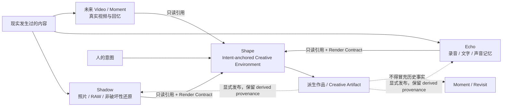

边界规则：

- Shadow/Echo 的 Original 与用户事实拥有最高权威；AI 观察是证据，不能改写事实。
- Shape 导入后，材料可以被重构、生成、替换、拼接和风格化；意图拥有最高权威。
- Shape 输出重新进入现实锚定系统时，必须标记为 `derived/creative`，并携带来源。
- Shape 不直接修改 Shadow Recipe、Echo AdjustmentGraph 或它们的 Catalog。
- “在 Shadow 中继续编辑”和“把 Shape 作品发布到 Shadow”是两个显式动作，不是隐式同步。

### 2.2 Shape、Infer Runtime 与执行器

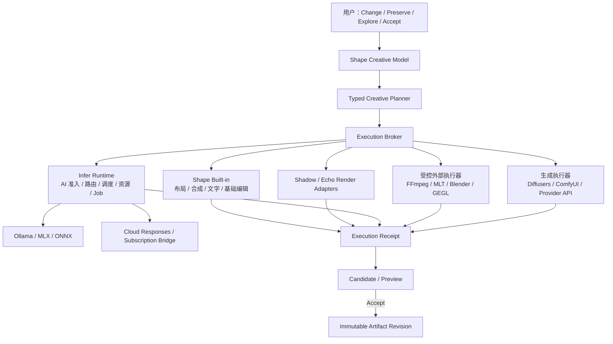

这里的核心边界是：

- Shape 决定“创作上要做什么”；
- Infer Runtime 决定“一个推理请求应由谁执行”；
- 外部执行器决定“如何完成特定媒体计算”；
- 用户决定“哪个结果被接受为作品状态”。

---

## 3. 核心创作循环

### 3.1 产品级动作

Shape 的一级交互不是 Prompt，而是四类动作：

| 动作 | 含义 | 例子 |
| --- | --- | --- |
| Observe | 选择当前作品、组件、区域或时间范围 | 选中人物、背景、音频片段或一段文字 |
| Preserve | 声明不能被破坏的部分 | 人物身份、姿势、台词、节奏、镜头长度 |
| Change | 声明希望发生的变化 | 换背景、重写语气、缩短、添加环境声 |
| Explore | 产生并比较多个可行方向 | 三种光线、两种措辞、不同构图 |
| Accept | 把一个候选晋升为新的已接受状态 | 接受 V2，保留 V1 为分支 |

### 3.2 状态机

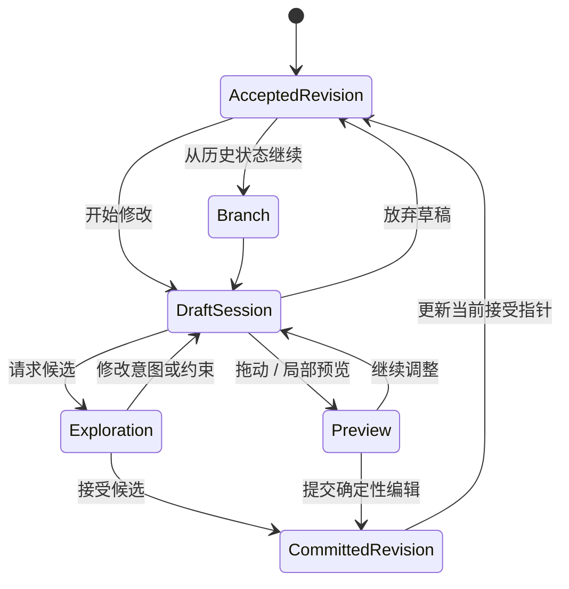

重要规则：

- Slider 拖动和时间线 scrubbing 不产生 Revision；它们只是 DraftSession 内的 ephemeral preview。
- Commit 才创建不可变 Revision。
- AI 候选可被临时缓存；只有 Accept/Pin/Branch 才进入长期创作历史。
- Undo 在草稿阶段回放局部操作；Commit 后的 Undo 是移动当前接受指针或创建逆向 Transformation，不删除历史。

---

## 4. Creative Document Model

### 4.1 核心对象

第一版领域对象收敛为：

```text
Project
Scene
SceneRevision
OperatorGraph
GraphComponent
Artifact
ArtifactRevision
ArtifactContent
Transformation
Constraint
ReferenceBinding
Exploration
ExecutionReceipt
Import
Export
```

`Capability`、`Executor`、`ExecutionPlan`、`Job` 和 `PreviewSession` 属于运行时，不是用户主要心智模型。
Scene 与 GraphComponent 是创作文档对象；二者都不能保存 provider 专属 workflow。

### 4.2 对象关系

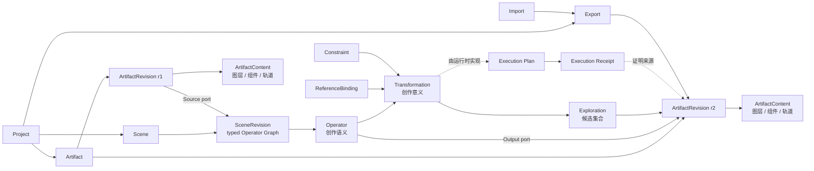

### 4.3 Scene、Operator Graph 与 GraphComponent

**Scene** 是一个项目内可独立打开、编排、运行和发布的创作单元。一个 Project 可以包含多个
Scene；每个 Scene 有自己的版本化 Operator Graph、草稿状态、Candidate 和命名 Output。

Scene Graph 的节点只有三种基础角色：

| 角色 | 负责 | 不负责 |
| --- | --- | --- |
| Source | 将 pinned Import、Artifact Revision、文件或上游命名输出引入 Scene | 修改输入、隐藏执行步骤 |
| Operator | 用稳定创作语义声明一次变换；可有多个类型化输入与输出 | 绑定物理模型、泄漏 provider workflow |
| Output | 给一个上游端口命名并声明发布合同；一个 Scene 可有多个 Output | 执行新的变换 |

Operator Graph 是类型化 DAG：连接必须精确匹配端口数据合同，一个输入端口最多连接一个上游，
节点可有零到多个输入和一个或多个输出，循环在首版被拒绝。Source 是纯输入，Output 是纯接口；
二者不能被便利性逻辑悄悄折叠进 Edit 节点。

这里的 Graph 不是“接受历史的只读可视化”，而是 Scene 的首要创作界面。Working Graph 必须允许：

- 未选中任何节点时，从节点库创建 Source、Operator 或 Output；
- 节点在尚未连接时以合法、可恢复的 detached 状态存在；
- 从输出端口拖线到兼容输入端口，或点击端口旁的 `+` 快速创建并连接下游节点；
- 一个 Operator 接受多个异构素材输入；连接保存的是精确端口和上游输出身份；
- 节点位置、折叠状态和可复用意图属于 Working Graph；生成结果不覆盖这些 authored state；
- 锁定某个 Candidate 后，节点的输出 binding 指向一个不可变 Revision，节点本身仍可再次执行。

接受的 Transformation/Revision 历史仍是来源权威，但它是 Working Graph 的执行结果和 lineage，
不是用来冒充当前可编辑图的替代模型。兼容期桌面仍可能从 Artifact 历史投影旧 Scene；新建 Scene
必须逐步迁移到真正的 `SceneWorkingGraph`，而不是继续扩张 artifact-as-scene 假设。

当前过渡实现允许在没有文本素材时先创建一个 detached `text.edit`：它用一个尚无 accepted head
的 `TextDocument` 目标和零输入 Working Graph 持久化节点意图，界面明确显示“等待连接素材”并禁止
执行。这个桥接只证明“先建节点、后接素材”的交互成立，不代表 artifact-as-scene 已经具备任意
多素材连线能力；真正的端口连接仍由下一版 `SceneWorkingGraph` 合同负责。

文本编辑中的用户表达不能退化为当前模型的参数表。编辑动作、语气、文体和受众是四个独立维度：
语气允许组合与强度调节，并可由用户用名称和自然语言说明创建个人预设；内置入口使用统一的抽象
视觉标记，而不是平台 Emoji。个人预设只是复用来源，节点保存被选中预设的内容快照，因此模型、
个人库或执行能力变化都不能让既有节点意图静默漂移。执行规划器可以把该表达编译给不同模型或
多阶段管线；某个执行器能力不足时应明确报告限制，而不是从创作界面删去用户可以表达的意图。

#### 4.3.1 首批素材输入节点

| 节点 | 稳定产品身份 | 内容与来源规则 | 首批输入方式 |
| --- | --- | --- | --- |
| 文本素材 | `source.text` | UTF-8 内容进入 Shape object store；源文件可空 | 直接输入、粘贴、文本文件 |
| 图片素材 | `source.image` | 原始粘贴/导入字节与规范化预览分离；源文件可空 | 剪贴板、PNG/JPEG 文件 |
| 文件素材 | `source.file` | 保存 content-addressed snapshot；原路径只是可选 provenance，不是打开项目的前提 | 文本、图片、PCM WAV 音频 |

粘贴来的文字或图片是一等 Source，不得伪造临时路径。文件导入后项目必须能离线重开；“引用原文件”
若以后加入，需要显式选择 link/pin 策略和失效状态，不能静默改变首版 snapshot 语义。

**GraphComponent** 是可复用的封装子图。它显式声明输入、输出和版本；实例在上层 Scene 中表现
为一个 Operator，但内部仍可展开。修改 Component 定义产生新版本，既有实例默认 pinned，不
静默漂移。GraphComponent 与 ArtifactContent 内的 Layer/Clip/媒体 Component 是不同概念：前者
复用 workflow，后者构成某个媒体值。

### 4.4 Artifact 与 ArtifactRevision

**Artifact** 是用户可识别的稳定创作对象，例如：

- `Character/Panda`
- `Book/Cover`
- `Image/RainyPark`
- `Narration/Main`
- `Video/VerticalCut`

**ArtifactRevision** 是该对象某个不可变、已接受状态，例如 `Cover@r12`。

不变量：

- Revision 一旦被提交并被其他对象引用，其内容和来源不可静默改变。
- 新变化产生新 Revision；Artifact 的 `accepted_revision` 指针显式前移。
- 删除 Artifact 默认只删除可见入口；仍被 Import/Export/Revision 引用的内容不能被回收。
- 每个 Revision 至少拥有可查看的 materialized preview；即使原执行器消失，结果仍可查看。

### 4.5 Scene 节点与 Artifact 粒度

Scene Operator Graph 不应退化成“每个节点都是一份文件”，也不应把每个图层都提升为 Scene
节点。采用三个明确层次：

```text
Scene Operator Graph：Source / Operator / Output，负责创作编排
└── ArtifactRevision：在类型化端口间流动的不可变已接受值
    └── ArtifactContent：媒体工作台内部结构
        ├── Component / Layer / Clip / Track / Object
        ├── Mask / Selection / Range
        └── Embedded or referenced media
```

组件规则：

- 组件在 ArtifactContent 内拥有稳定 `component_id`，可以被选择、约束和引用。
- 媒体组件只有在需要跨 Artifact/Project 复用或单独发布时，才提升为独立 Artifact 或 Source。
- 内部图层和轨道的编辑历史不全部进入 Scene Operator Graph；它们通过 Content revision 与 Transformation 摘要表达。
- 组件身份无法稳定保留时，Transformation 必须显式记录 `identity_rebound`，不能假装仍是同一对象。

#### 4.5.1 Operator 粒度：创作动作，而不是滤镜清单

主图默认只暴露用户能说清楚、能反复调整、能独立接受的一次创作动作。裁切、重采样、降噪、
分割、色彩匹配等原子步骤可以有确定性执行器，也可以在高级模式下显式展开，但它们通常应是
综合 Operator 的内部 Execution Plan，而不是逼用户手工串出几十个节点。

首批综合族保持以下清晰边界：

| 族 | 稳定 Operator | 心智模型 | 首选责任 |
| --- | --- | --- | --- |
| 通用媒体编辑 | 产品级 `image.edit` / `text.edit`；内部记录精确方法 | 在一个阶段内选择裁切、尺寸、直接写作或 AI 辅助，不手工串原子节点 | Shape Workspace；执行继续使用 typed `image.crop`、`image.resize`、人工/Infer Transformation |
| 传统复合编辑 | `image.composite`、`audio.multitrack` | 有结构地编排 layer/mask/track/clip，AI 只是助手 | Shape 自有 Content Workspace |
| 传统专用编辑 | `image.color_grade`、`audio.repair` | 精确专业编辑，允许 AI 辅助但不以生成替代编辑 | 优先 Shadow/Echo Adapter；Shape 保存语义与 Candidate |
| 纯 AI、无素材 | `image.generate`、`audio.generate` | 从 Intent 与输出合同创建新媒体 | Infer/专用生成 Executor |
| 纯 AI、有素材 | `image.generate_from_materials`、`audio.generate_from_materials` | 以一个或多个显式素材和角色约束生成 | 必须使用真实 typed multimodal 合同 |

`image.generate` 与 `image.generate_from_materials` 不能因为共享一个界面就合并身份：前者是零素材
Source Operator；后者至少有一个 `input.materials`，每个输入固定接受 Revision 与角色。两者都只有
一个逻辑图片输出；一次执行得到的多个结果进入 Candidate Shelf，而不是把节点输出端口数量变成
“模型生成了几张”。若 Runtime 只有纯文本生图，UI 必须把带素材生成标记为 capability unavailable，
不能把文本理解或图片描述接口冒充图像编辑器。零素材形态已经拥有 candidate.4-only 的 Infer
执行器、严格 PNG/Job provenance 复验，以及 Core 内“先 Candidate、后显式 Accept”的纵向回路。
桌面现在也能原子创建 Scene 级零输入 Draft，恢复精确 prompt/canvas，并通过独立异步控制器把
结果放入 Candidate Shelf；但当前 Shape App ACL 尚未授权所需的
subscription/balanced/cloud-only 策略，因此真实在线执行继续 fail closed，且不会污染已接受历史。

### 4.6 ArtifactContent 类型

| Kind | 内部结构 | M0/M1 |
| --- | --- | --- |
| `text.document` | blocks、spans、style、semantic anchors | M0 |
| `image.raster` | flattened raster + color contract | M0 |
| `image.composite` | layers、masks、blend、transform、embedded refs | M0/M1 |
| `reference.set` | typed references 与角色 | M1 |
| `audio.clip` | immutable WAV value contract + truthful origin disclosure | M1 foundation |
| `storyboard` | ordered frames、captions、shot metadata | 后续 |
| `audio.composition` | clips、tracks、gain/effect graph | M3 |
| `video.sequence` | tracks、clips、transitions、subtitles | M4 |
| `scene.3d` | scene document 或外部 `.blend` snapshot | M5 |
| `bundle` | 多个相关 Artifact Revision 的命名集合 | M2 |

第一版不要抽象出一个万能媒体树。每种 Content 有独立 schema，但共享身份、版本、引用和 provenance 规则。

### 4.7 Transformation

Transformation 回答：

> 为什么这些输入变成这些输出？

建议结构：

```rust
Transformation {
    id,
    kind,                    // image.change_background 等稳定语义
    inputs: [RevisionRef],
    intent: IntentSpec,
    constraints: [Constraint],
    references: [ReferenceBinding],
    target_components: [ComponentRef],
    expected_outputs: [ArtifactContract],
    authored_by: User | Assistant | Imported,
    created_at,
}
```

Transformation 不直接保存 provider、模型、FFmpeg 参数或 ComfyUI workflow。这些进入 Execution Plan/Receipt。

### 4.8 Constraint

Constraint 是一等对象，而不是 Prompt 中的一段自然语言。首版类型：

| 类型 | 例子 | 验证方式 |
| --- | --- | --- |
| Preserve identity | 人物、角色、Logo 不变 | 人工比较；可选 embedding/vision evidence |
| Preserve geometry | 姿势、镜头、构图不变 | component/mask/landmark comparison |
| Preserve content | 台词、事实、主体列表不变 | schema/text diff |
| Preserve timing | 时长、切点、节拍不变 | deterministic timeline validation |
| Region scope | 只允许背景区域变化 | mask coverage / pixel diff |
| Output contract | 2048px、16:9、透明背景、48kHz | schema/render validation |
| Avoid | 不增加文字、不出现额外人物 | multimodal validation + user review |

Constraint 有三种强度：

```text
Hard       违反即候选失败
Preferred  排序降级，但允许展示
Advisory   仅作为创作方向
```

AI 无法可靠验证的约束必须标记为 `unverified`，不能显示成已经保证。

### 4.9 ReferenceBinding

Reference 是带角色的关系，不是普通输入文件：

```text
identity
style
composition
palette
lighting
voice
motion
negative-reference
```

同一个 Artifact Revision 可被多个 Transformation 以不同角色引用。Reference 不被消费，也不意味着输出必须复制它。

### 4.10 Exploration 与 Variant

为了避免一次生成 8 个候选就污染主图，引入 Exploration：

```rust
Exploration {
    id,
    transformation_id,
    candidates: [Candidate],
    selected_candidate?,
    pinned_candidates: [],
    retention_policy,
}
```

- Candidate 有完整 output digest 与 ExecutionReceipt。
- 未固定候选可以按空间策略回收，但 UI 必须提前说明。
- Accept 把 Candidate 晋升为 ArtifactRevision。
- Pin 保留候选但不改变当前 accepted revision。
- Branch 从候选创建新的 Artifact 或分支。

### 4.11 Scene Operator Graph 与另外两张图

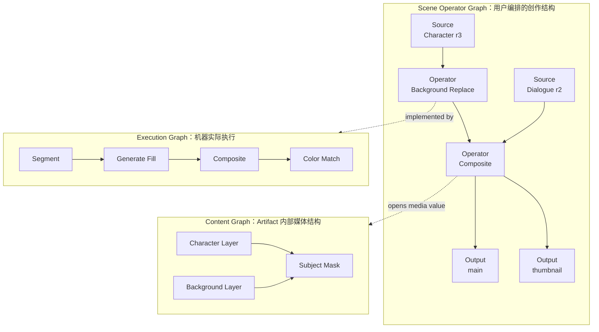

三张图必须分离：

- Scene Operator Graph 默认可见，表达用户选择的创作模块与数据流。
- Content Graph 只在对应 Workspace 内展开。
- Execution Graph 默认隐藏，只用于诊断、高级设置和 provenance。
- 一个创作 Operator 可以对应零个、一个或多个 Execution Job；两者没有一一映射要求。
- Source/Output 是 Scene 接口，不是省略掉的 Import/Export 执行步骤。

---

## 5. Project、Export 与 Import

### 5.1 Project 是 Creative Module

```text
Shape Project
├── Scenes
│   └── Versioned Source / Operator / Output Graphs
├── Reusable GraphComponents
├── Artifact Contents
├── Explorations
├── Execution Receipts
├── Imports + dependency lock
├── Exports
└── Materialized previews / renders
```

Project 在概念上是模块集合：Scene 是可运行创作入口，GraphComponent 是可复用内部模块，
named Output 是其他 Scene/Project 的稳定消费接口。在物理上仍需要可迁移的存储容器。推荐首版格式：

```text
MyProject.shape/
├── manifest.json             项目身份与 schema revision
├── project.sqlite            领域记录、索引、事务
├── objects/                  BLAKE3 内容寻址对象
├── previews/                 可删除、可重建缓存
├── receipts/                 大型/外部执行回执（必要时）
└── imports.lock              固定的跨项目依赖解析结果
```

用户不需要直接操作内部文件。Portable archive 是这个目录的序列化，而不是 Project 本身的定义。

### 5.2 Export 是接口

```rust
Export {
    name,
    artifact_id,
    channel,                  // accepted | release | preview
    published_revision,
    artifact_contract,
    render_profiles,
}
```

规则：

- Export 指向已发布 Revision，而不是任意草稿。
- 更新 Export 是一个显式 Publish 操作。
- Export 可声明多个 render profile，但不必预先存在对应文件。
- 文件导出只是 `serialize(render(export, profile))`。

### 5.3 Import：Pinned、Watch 与 Vendor

不建议把 `Live` 定义成“上游变化后静默改变下游作品”。改成三种策略：

| 策略 | 行为 | 用途 |
| --- | --- | --- |
| Pinned | 永远使用明确 Revision | 默认；可复现作品 |
| Watch | 发现上游新发布版本并显示 pending update，不自动改作品 | 角色、风格、系列项目 |
| Vendored | 把上游 Revision 内容和来源复制进本项目 | 离线归档、长期交付 |

更新流程：

```text
检测到 Character/main r12 → r15
→ 解析 change summary
→ 在下游生成影响预览
→ Update / Keep / Vendor / Fork locally
→ 接受后产生新的下游 Revision
```

### 5.4 依赖规则

- Project Import 图必须是 DAG；产生直接或间接循环时拒绝发布。
- `Watch` 只跟踪 Export channel，不跟踪“项目里最新任意节点”。
- 上游 Project 离线时，Pinned/Vendored 仍可使用已 materialize 的内容。
- 上游删除公开入口不能破坏已发布 Revision；真正 GC 前必须证明没有外部租约或 vendored snapshot 需求。
- 跨项目 `shape://` URI 只定位接口，依赖锁记录最终 Project ID、Export、Revision 与 digest。

建议 URI：

```text
shape://project/{project-id}/export/{name}@{revision}
shadow://library/{library-id}/asset/{asset-id}@{source-revision}
echo://library/{library-id}/asset/{asset-id}@{source-revision}
```

URI 只是逻辑身份；物理访问必须通过对应应用的公开 resolver/render API。

---

## 6. 总体技术架构

### 6.1 推荐技术栈

为了与 Shadow/Echo 形成同系列产品并复用工程经验：

| 层 | 推荐实现 | 原因 |
| --- | --- | --- |
| Desktop UI | Qt 6 / QML | 与 Shadow/Echo 同构，跨 macOS/Windows，便于共享视觉 token 和平台经验 |
| Domain/Core | Rust | 不变量、事务、并发、序列化、跨平台核心 |
| Media kernels | C/C++ libraries behind narrow bridges | 接入 FFmpeg、OCIO、OIIO/MLT 等成熟内核 |
| Project store | SQLite + BLAKE3 CAS | 原子事务、可恢复、内容寻址、可验证缓存 |
| Preview | Qt scene graph + media-specific render adapters | 不建立万能 Canvas |
| AI control | Infer Runtime consumer + Shape direct capability adapters | 复用已有资源控制，同时允许 provider-specific 创意能力 |

Shape 自有代码采用 MIT License。Shadow 的 GPL 内核保持独立进程或公开 API 协议边界，不直接链接进 Shape 的 MIT 分发物；若未来选择组合分发，必须单独评审并明确适用的 GPL 义务。

### 6.2 模块分层

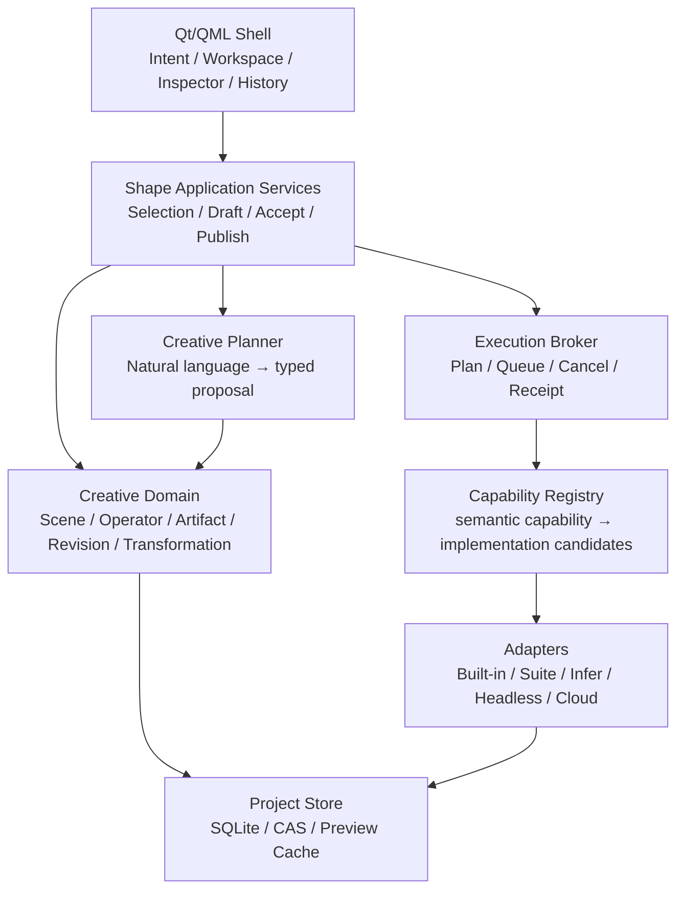

### 6.3 各层职责

| Owner | 负责 | 不负责 |
| --- | --- | --- |
| Creative Domain | Scene/Operator 不变量、Artifact 版本、依赖、发布 | 模型选择、进程管理、像素算法 |
| Application Services | 用户动作、草稿、比较、接受、撤销 | 直接调用 shell 或 provider |
| Creative Planner | 把自然语言变成类型化 Transformation proposal | 自主提交不可逆修改、决定最终接受结果 |
| Capability Registry | 描述可用能力和约束，选择实现族 | 伪装 provider 差异、替代 Infer Runtime 的资源路由 |
| Execution Broker | 计划、任务状态、取消、重试边界、Receipt | 创作语义和项目版本 |
| Infer Adapter | 调 Infer Runtime，映射 Job/Attempt/provenance | Agent、会话记忆、Scene Operator Graph |
| Media Adapter | 调 FFmpeg/MLT/Shadow/Echo 等 | 改写 Project 或用户事实 |
| Store | 原子发布、CAS、GC、迁移 | 推断作品语义 |

---

## 7. Capability Registry 与执行合同

### 7.1 Capability 描述

Shape 的 Capability 是创作运行时概念，例如：

```text
image.adjust
image.mask.subject
image.generate
image.edit.region
image.composite
image.upscale.fidelity
image.upscale.creative

text.rewrite
text.structure
text.translate

audio.render
audio.transcribe
audio.align
audio.speech_synthesize
audio.mix

video.compose
video.generate
video.lipsync
video.render

scene.render
```

每个 capability 声明：

```rust
CapabilityDescriptor {
    id,
    input_contracts,
    output_contracts,
    supported_constraints,
    preview_mode,
    determinism,
    locality,
    privacy_classes,
    execution_modes,
    cancellation,
    cost_shape,
    implementation_specific_options,
}
```

### 7.2 不做虚假的统一

Capability 统一的是稳定语义，不抹掉有意义的差异：

- 一个 provider 能严格锁定角色身份，另一个不能，这必须体现在 capability evidence 中。
- 一个执行器支持局部实时预览，另一个只支持整次异步生成，UI 行为不能伪装一致。
- 模型特有的 LoRA、ControlNet 或 camera control 可以作为 implementation-specific advanced options，但不进入基础 Transformation schema。
- 不支持 Hard Constraint 的实现不能被计划器选中后再“尽量试试”。

### 7.3 Execution Plan 与 Receipt

```rust
ExecutionPlan {
    id,
    transformation_id,
    steps,
    chosen_implementations,
    input_materializations,
    expected_outputs,
    privacy_decision,
    resource_estimate,
    cache_key,
}

ExecutionReceipt {
    plan_id,
    attempts,
    input_digests,
    output_digests,
    implementation_ids,
    tool_or_model_builds,
    workflow_or_parameter_digest,
    seed,
    actual_execution_route,
    fallback_reason,
    timing,
    usage_and_cost,
    validation_results,
}
```

确定性、seeded stochastic、remote opaque 三种重现等级必须区分：

| 等级 | 含义 |
| --- | --- |
| Exact | 相同实现、输入和参数应逐位或在定义容差内一致 |
| Reproducible intent | 保存足够来源，但模型/硬件差异可能改变像素 |
| Materialized only | 只保证保存已接受结果，无法保证将来重算 |

### 7.4 执行器接口

每个 Adapter 至少实现：

```text
probe()                  可用性、版本、能力、许可证身份
validate(plan)           输入、约束、隐私、输出合同
estimate(plan)           时间、内存、磁盘、费用（允许 unknown）
execute(plan, events)    执行并产生类型化进度
cancel(job)              协作取消；披露是否只能丢弃迟到结果
collect(job)             输出、诊断、实际路线
```

Runtime Job 状态统一为：

```text
planned → admitted → queued → running → validating → succeeded
                           ↘ cancelled / failed / abandoned
```

`succeeded` 仍不等于被用户接受；它只表示产生了有效 Candidate。

---

## 8. 与现有 Infer Runtime 的集成

本节以 2026-08-12 的 `infer-runtime` tracked candidate.4 合同与既有本机实证为快照。Shape 必须按运行时的 contract
manifest、typed route 和 App ACL 启用功能，不能把本机工作树或当前 daemon 的配置当作已经
发布的跨机器合同。

参考：[`infer-runtime/DESIGN.md`](../infer-runtime/DESIGN.md)、[`docs/INTEGRATION.md`](../infer-runtime/docs/INTEGRATION.md)、[`ROADMAP.md`](../infer-runtime/ROADMAP.md)。

### 8.1 当前可复用能力

| 能力族 | 当前能力 | Shape 用途 | 状态判断 |
| --- | --- | --- | --- |
| Text Responses | `text.edit`、`text.summarize`、`text.proofread`、`language.respond`、`reasoning.solve` | 有界文本编辑、Intent 解析辅助、文案、故事、结构化建议 | candidate.4 增加具名路由；首个 `text.edit` 只授权本地 4B Deployment |
| Local/Cloud routing | Ollama、本地 MLX/ONNX、DeepSeek cloud、Codex subscription bridge | 本地优先、质量优先、显式订阅模型 | 已有；App ACL 决定能否使用 |
| Audio | `audio.transcribe`、`audio.align` | Echo 音频文字、字幕、定位 | 已有类型化 endpoint |
| Speech | `speech.synthesize` | preset 旁白 Audio Candidate | Shape 已完成桌面生成、按需试听、接受/重开与真实本机验证；alias/ACL 尚未由 Infer 提交发布 |
| Face | `vision.detect_faces`、`vision.embed_face` | 身份保持验证的辅助证据 | Experimental；SensitiveBiometric、local-only |
| Cross-modal embedding | `vision.embed_image`、`vision.embed_text` | Reference 检索、相似候选、素材发现 | Experimental；当前 768d shared space、local-only |
| Image+text reasoning | `multimodal.respond` / VL 路线 | 理解画面、验证部分约束、生成 Change proposal | 当前处于工作树演进中；只在新合同冻结并 probe 成功后启用 |
| Image/video generation | 无稳定 typed family | 生成、编辑、视频 | 初期走 Shape 外部执行器；形成多 consumer 需求后再提议进入 Infer Runtime |

当前物理部署快照如下。它用于估算可行性和规划 Adapter，不应进入 Project 的创作语义。Shape 的
creative graph 仍只保存 Intent；candidate.4 Consumer 可在执行边界按 App 授权请求 Runtime
Deployment 或 Model Profile，但不能请求 provider、Build 或物理模型字符串：

| 数据面 | 当前已登记实现 | Shape 采用原则 |
| --- | --- | --- |
| 本地文本 | Qwen 3.5 2B/4B、Qwen 3.6 35B，经 Ollama/Responses 路线 | 小任务优先轻量候选；35B 不作为短文本默认，具体路由交给 Runtime |
| 本地视觉语言 | Qwen3-VL 4B/8B 已登记模型与 reload evidence | 等待类型化 image+text consumer contract 收口，不从模型登记推断 API 已稳定 |
| 标准云文本 | DeepSeek V4 Flash Responses provider | 只有 Shape cloud policy 与项目外发策略均允许时进入候选 |
| 订阅模型 | Codex 5.6 Luna/Terra/Sol，经登录态 App Server bridge | `placement=cloud`、`access_class=subscription`；不暴露 Codex tools/thread/workspace |
| 本地语音识别 | Qwen3-ASR 1.7B | 通过 `audio.transcribe`，不由 Shape 管理 worker |
| 本地强制对齐 | Qwen3 ForcedAligner 0.6B | 通过 `audio.align` |
| 本地语音生成 | Qwen3 TTS CustomVoice 1.7B | 当前仅经版本化 preset alias 映射 `speech.synthesize`；Voice Design/Clone 不宣称可用 |
| 本地人脸 | YuNet 2026May + SFace 2021Dec ONNX | 仅 local-only experimental evidence；不成为默认创作身份机制 |
| 本地图文向量 | SigLIP 2 Base patch16 224 image/text ONNX，共享 768d space | 用于本地 Reference 检索；必须按完全相同的 embedding space 做索引版本化 |

Consumer 使用 inference API `http://127.0.0.1:8787`；Web Console 端口不是 Shape 数据面。Shape token 只能由 Runtime 生成并写入 Shape 自己的 owner-only secret store，不能写进 Project、设置导出、命令行参数或日志。

### 8.2 为什么不把所有 AI 都直接塞进 Infer Runtime

Infer Runtime 已明确是推理控制平面，不负责业务工作流、Prompt 编排、Agent 或领域状态。Shape 应遵守这一边界：

- Shape 持有 `Transformation`、`Constraint`、Reference role、Candidate 和用户接受决定。
- Infer Runtime 收到稳定 Intent、类型化 payload 和硬约束，返回 Job/Attempt/Build/provenance。
- 一个 Shape Transformation 可以调用多个 Infer Job；这些 Job 只出现在 Execution Graph。
- provider-native 的创意能力如果只有 Shape 使用且变化很快，可先作为 Shape Adapter；当资源竞争、统一路由或第二个 consumer 出现时，再建立 Infer Runtime 的 typed data plane。

### 8.3 Shape App ACL 建议

不要直接复用 `local-operator`。为 Shape 创建独立、非资源管理员 App，并分阶段开放。

首个 local-first M0/M1 建议：

```toml
[apps.shape]
credential = { source = "managed" }
resource_admin = false
allowed_intents = [
  "text.edit",
]
allowed_provider_access_classes = ["standard"]
max_pending_jobs = 8
default_policy = "local-first"
allowed_policies = ["local-first"]

[apps.shape.request_overrides]
priority = ["interactive", "normal"]
placement = ["local_only"]
prefer = ["local"]
offline_required = true
capability_floor = ["foundational"]
latency = ["interactive", "balanced"]
fallback = ["none"]
max_cost_usd = { min = 0.0, max = 0.0 }

[apps.shape.routing]
deployment_ids = []
model_profile_ids = []

[apps.shape.routing.intents."text.edit"]
deployment_ids = ["ollama_qwen3_5_4b"]
model_profile_ids = []
```

这里有两层不同的“全局”。`allowed_intents`、provider class、cloud modality、policy、override 和
cost 组成 App 全局安全上限，任何 Intent 都不能突破。`apps.shape.routing` 只是没有专属规则时的
路由默认值；`routing.intents."text.edit"` 一旦存在就完整替换该默认值，空列表即 deny-all，不会
退回全局路由授权。Consumer 的具名列表仍是有效授权内的有序硬收窄，不是绕过 ACL 的模型选择器。
未授权目标在创建 Job 和调用 Provider 前返回 `403 route_target_forbidden`；已授权但当前不可执行
返回 `409 no_candidate`。`fallback=none` 只允许第一个具名目标，只有显式 `equivalent` 才可按授权
列表尝试后续等价目标。

注意：tracked 规划不等于 live 配置已经启用。正式接入仍要由 Infer Runtime owner 发布 candidate.4、
通过 Console-owned 流程重启，再单独修改 ignored live `apps.shape` ACL；managed token 只保存在
Shape owner-only secret store，不能进入 Project、设置导出或日志。

云图像与 subscription 必须是第二次显式授权：

- 只有用户开启 cloud creative processing，App 才加入 `subscription` access class；
- `allowed_cloud_input_modalities` 单独开放 `image`，不能因为允许云文本就自动上传图片；
- Shape 每次操作仍执行 project/asset 级 privacy admission；
- 从 Shadow 导入时默认只允许用户确认过的 rendered RGB proxy 和 mask 外发，绝不上传 RAW、sensor mosaic 或生物特征向量。

### 8.4 Infer Job 到 Shape Receipt 的映射

Shape 必须保存：

```text
runtime contract revision
intent
job id
attempt ids
provider / deployment / model build
actual placement
fallback reason
input source revision / digest
output digest
usage / cost
stable error code
```

不要保存 bearer token、私有 prompt 的通用日志副本、face embedding 或未经项目策略允许的 provider response body。

### 8.5 启动与降级

- Shape 启动时读取 Runtime manifest 并 probe 必需 capability。
- Runtime 不在线时，Project、历史、内置确定性编辑、预览和导出仍可工作。
- 某能力不可用时显示“当前不可重新执行”，但已 materialize 的 Revision 仍可用。
- 不允许从 `local_only` 失败静默回退到 cloud。
- Streaming、duplex 和 multimodal 在合同未冻结前不作为 M1 退出门槛。

---

## 9. Shadow 与 Echo 集成设计

### 9.1 当前现实校准

**Shadow 当前已有：**照片 Catalog、内容寻址缓存、RAW/预览/非破坏性 Recipe 与渲染内核、显式用户决策、Infer Runtime 人脸/SigLIP 切片等。它尚未为 Shape 冻结通用 `shadow://` read/render API。

**Echo 当前已有：**音频 Catalog、FFmpeg 解码、waveform、播放、ASR/align/contextual evidence 与后台任务。其路线图把 `echo://asset/{uuid}` 的只读 memory/render API 放在后续 M5，因此 Shape 不能直接依赖 Echo 内部 SQLite schema。

参考：[`Shadow README`](../shadow/README.md)、[`Shadow AI 能力规划`](../shadow/crates/shadow-ai/AI_CAPABILITY_PLAN.zh-CN.md)、[`Echo README`](../echo/README.md)、[`Echo ROADMAP`](../echo/ROADMAP.md)。

### 9.2 统一的 Suite Asset Contract

Shadow/Echo 可以共享信封结构，但保留分媒体 render request：

```rust
SuiteAssetDescriptor {
    uri,
    app,
    library_id,
    asset_id,
    source_revision,
    media_kind,
    privacy_class,
    provenance_summary,
    available_representations,
    capabilities,
}
```

最小接口：

```text
resolve(uri) -> SuiteAssetDescriptor
materialize(uri, representation_contract) -> ReadLease + local path/stream
render(uri, render_contract) -> RenderedRepresentation + provenance
subscribe(uri) -> revision changed / offline / deleted events
release(lease)
```

要求：

- 通过应用公开服务访问，不打开对方数据库。
- 返回 owner 应用定义的 `source_revision` 和 render contract revision。
- Materialization 使用有界 lease；Shape 不把临时路径当永久身份。
- Shadow/Echo 离线时保留上次 pinned materialization，但明确标记来源离线。
- 事件只表示“有更新可用”，不能静默改变 Shape Revision。

### 9.3 Shadow Adapter

建议能力：

```text
shadow.asset.resolve
shadow.render.display
shadow.render.export
shadow.mask.subject       // 只在 Shadow 对外合同稳定后
shadow.recipe.summary
```

Shape 保存的是：

```text
Shadow asset URI
+ source revision
+ recipe/render revision
+ requested representation contract
+ returned artifact digest
```

不保存或改写 Shadow 的内部 Recipe 节点。需要精细 RAW 调整时提供“Open in Shadow”；用户在 Shadow 提交新 Recipe 后，Shape 显示 pending update。

#### 9.3.1 外部编辑往返：避免在 Shape 重造 Shadow

`image.color_grade`、RAW 还原和相机特定调色仍然是 Shape 的创作语义 Operator，但默认执行路线
优先交给 Shadow，而不是在 Shape 内复制一套较弱的 Recipe、色彩面板和渲染管线。Shape 的责任是
保存输入、意图、版本和接受历史；Shadow 的责任是提供成熟照片编辑工作区并产出可验证结果。

一次外部编辑会话至少固定：

```text
External Edit Session
  input Artifact Revision + exact content digest
  Shape Operator Draft + representation/color contract
  adapter identity + capability/contract revision
  bounded materialization lease
  opaque external session identity

External Edit Return
  exact returned bytes + content digest
  input revision echoed back
  execution receipt + Shadow recipe/render revision
  disclosure/warnings
```

往返状态只有 `prepared → opened → returned | cancelled | expired`。Shadow 不获得 Shape Project
数据库写权限，Shape 也不读取或复制 Shadow 的内部 Recipe 图。返回内容先成为 Shape Candidate；只有
用户 Accept 才推进 Artifact Revision。若等待外部编辑期间输入 head 已变化，返回结果仍可保留在
Exploration，但原基线上的 Accept 必须失败，用户需要显式分支或重新基于新 head 编辑。

这条边界同样适用于其他成熟软件：只有可移植、确定、离线且确有自动化消费者的原子操作（例如
crop、resize、格式/色彩空间转换）才适合内建；交互式调色、RAW、复杂音频修复等优先通过能力
Adapter 接入。OpenColorIO 可执行明确的色彩空间 transform，但不因此成为另一套创意调色系统。

### 9.4 Echo Adapter

建议能力：

```text
echo.asset.resolve
echo.render.pcm
echo.render.file
echo.waveform.read
echo.transcript.read
echo.adjustment.summary
```

Shape 不重做 Echo 的来源、文字证据和恢复性 Adjustment。创意剪切、重排、配乐和生成声音进入 Shape-owned `audio.composition`。

### 9.5 反向发布

Shape → Shadow/Echo 只能通过显式动作：

```text
Publish derived image to Shadow
Publish derived audio to Echo
```

发布产生新的派生资产，携带：

- Shape Project/Export/Revision；
- 输入 Shadow/Echo source revision；
- transformation summary；
- synthetic/derived disclosure；
- materialized file digest 与媒体 metadata。

它不能替换 Original，也不能把生成内容混成 Moment 中未经标注的历史记录。

---

## 10. 外部执行器与现有编辑软件规划

接入策略分为三层：

1. **Embedded kernel**：合同稳定、可测试、性能关键的库，直接放在窄桥后。
2. **Managed headless executor**：以固定版本的独立进程运行，Shape 提交类型化计划并收集输出。
3. **External round-trip**：把工作副本交给完整编辑器，用户编辑后以新 digest 重新导入，不假装实时共用同一内部文档。

### 10.1 推荐矩阵

| 软件/项目 | 适合承担 | 接入模式 | 阶段 | 关键判断 |
| --- | --- | --- | --- | --- |
| Shadow Render Layer | RAW、照片调整、高质量图像表示 | Suite API；许可证明确后可评估链接 | M1 | 首选照片来源和还原能力，不复制 RAW pipeline |
| Echo Audio Engine | 解码、PCM、waveform、恢复性调整 | Suite API | M3 | 首选现实录音来源，不复制 Catalog/证据层 |
| FFmpeg/libavfilter | codec、resample、mix、filter、mux、字幕、转码 | Embedded 或固定 build 子进程 | M0 起 | 统一音视频底座；冻结 build flags，因可选 GPL 组件会改变许可证 |
| libvips | 大图缩放、缩略图、代理、批处理 | Embedded | M0 | demand-driven、低内存；不承担 Shape 的创作语义 |
| OpenImageIO | 专业图片/序列 I/O、metadata、离线处理 | Embedded/CLI | M1/M4 | 适合 VFX 格式和 image sequence；不替代 Shadow RAW |
| OpenColorIO | 跨图片/视频/3D 的色彩空间与 transform | Embedded | M1 | Color Contract 的标准执行层 |
| GEGL | 长尾图像滤镜、非破坏性 operation 原型 | 可选 managed executor | M2 | 能命令行执行 operation graph；不作为 M0 硬依赖 |
| MLT / `melt` | 多轨音视频 composition、transition、headless render | Managed executor，稳定后可嵌入 | M4 | 真正的视频编辑框架；可序列化 XML；比手写 NLE render engine 可行 |
| OpenTimelineIO | timeline interchange、外部 NLE 往返 | Library / serialization | M4 | 只描述剪辑、轨道、转场等，不携带媒体，也不是 renderer |
| Kdenlive / Shotcut | 完整 NLE 人工精修 | OTIO/MLT round-trip | M4 | 不嵌入 UI；Kdenlive 已支持 OTIO import/export |
| Blender | 3D、合成、运动图形、复杂镜头、离线渲染 | 隔离的 background process + 受控脚本模板 | M5 | 能无 UI 渲染；不信任外部 `.blend` 自动脚本 |
| Krita | 复杂绘画、笔刷、分层 KRA 编辑 | External round-trip；CLI 只做导出 | M2 | Shape 不重做绘画系统；KRA 作为 opaque external document |
| Inkscape | SVG/矢量精修与稳定导出 | External round-trip + CLI export | M2 | Shape 首版只消费/渲染 SVG，不重做完整矢量编辑器 |
| Diffusers worker | 受控本地图像/视频/音频生成 pipeline | Shape managed worker | M1+ | Apache-2.0 代码便于做类型化 adapter；每个模型权重仍单独审计 |
| ComfyUI | 用户已有 workflow、模型和 custom node 生态 | 用户安装的外部服务 Adapter | M1+ advanced | 强大但 workflow/API 属 Execution Graph；GPL-3.0、custom node 与安全性需隔离 |
| InvokeAI | 本地生成/画布/工作流能力 | 可选外部服务 Adapter | M1+ evaluation | Apache-2.0 应用；是否采用取决于 API 稳定性和与 Shape 重叠程度 |
| Provider-native API | 独占质量、视频、角色一致性、lip-sync 等 | 独立 Adapter | 按需 | 保留特有能力；隐私、费用、保留和条款逐 provider 准入 |

### 10.2 推荐取舍

**M0/M1 默认组合：**

```text
Shape built-in composite/text/transform
+ libvips（代理/缩略图/批处理）
+ OpenColorIO（色彩合同）
+ Shadow Render Adapter（照片）
+ Infer Runtime（文本/理解/embedding）
+ 一个受控 Diffusers generation worker
+ 可选 ComfyUI user-installed bridge
```

理由：

- Diffusers worker 更适合由 Shape 定义稳定、类型化的少量生成任务；
- ComfyUI 适合兼容用户已有模型/workflow，但不能成为 Project document model；
- GEGL、Krita、Inkscape 是扩展和往返层，不应阻塞首个纵向切片；
- Video 到 M4 再引入 MLT/OTIO，避免一开始维护第二套时间线模型。

### 10.3 外部进程安全合同

所有 managed executor 必须：

- 以参数数组启动，不拼接 shell 字符串；
- 每个 Job 使用独立临时目录和只读输入 materialization；
- 只允许写入声明的输出目录；
- 默认禁网，只有 provider adapter 获准时开放固定域名；
- 固定 executable/version/build digest；
- 限制 CPU、内存、GPU、磁盘、时长和输出数量；
- stdout/stderr 有界并脱敏；
- 不执行来自用户项目的任意脚本；
- Blender 默认 `--disable-autoexec`，只运行 Shape 自带、版本化的脚本模板；
- ComfyUI custom nodes 视为本机代码执行，必须放在用户显式信任的独立环境；
- 输出经过格式、尺寸、时长、像素和 digest 校验后才能成为 Candidate。

### 10.4 许可证策略

代码许可、模型权重许可、训练数据条款和服务条款必须分开记录。

- FFmpeg 主要为 LGPL，但启用某些可选组件会使 build 进入 GPL；必须保存 configure/build identity。
- MLT 为 LGPL-2.1；OTIO 为 Apache-2.0；OpenImageIO 为 Apache-2.0；OpenColorIO 为 BSD-3-Clause；libvips 为 LGPL-2.1-or-later。
- ComfyUI 为 GPL-3.0，建议作为用户安装的独立进程；是否随产品分发需要单独法律审查。
- Blender/Krita/Inkscape 属 GPL 生态，优先作为外部应用或进程边界；不得把其 GPL 实现复制或直接链接进 Shape 的 MIT 分发物。
- Diffusers/InvokeAI 的代码许可不代表任意 checkpoint 可商用或可再分发。
- 每个 Executor/Model Build 都进入第三方台账，记录 URL、revision、digest、local patch、notice 和分发决定。

---

## 11. UI 与交互方案

### 11.1 应用框架

项目打开后直接进入 Scene Node Graph。节点库始终可用，不要求先选中节点：

```text
Scene Node Graph
├── 添加素材
│   ├── 文本：输入 / 粘贴 / 文本文件
│   ├── 图片：粘贴 / PNG / JPEG
│   └── 文件：文本 / 图片 / 音频
├── 添加编辑节点（允许暂时不连接）
├── 从端口拖线连接
└── 点击输出端口旁的 + 快速派生下游节点
```

节点表达用户决定保留和复用的创作阶段，节点内部的按钮和参数表达完成这个阶段的方法。
Source、Operator、Output、Candidate 仍有不同视觉结构，但端口和连接不再藏到“高级诊断”里：
它们是主界面的基本操作。物理模型、provider、sampler 和 Infer Job 继续留在折叠的执行诊断中。

```text
┌──────────────────────────────────────────────────────────────┐
│ Project / Current Scene                           Publish    │
├────────────┬─────────────────────────────────────────────────┤
│ Scenes     │ Editable Node Graph · ports · connections · +  │
│ Components ├──────────────────────────────────┬──────────────┤
│ Assets     │ Focused Node Workspace           │ Node intent  │
│            │ Materials / Prompt / Output      │ Options      │
│            │ Candidate review / refinement    │ Provenance   │
│            ├──────────────────────────────────┴──────────────┤
│            │ Candidate filmstrip · Compare · Accept · Branch │
└──────────────────────────────────────────────────────────────┘
```

Scene 图谱是 Scene 首页和主要创建入口；进入一个节点的专属工作台后，它收缩成顶部可点击的上下文带，而不是
完全消失。项目栏只保留 Scene、Component、Asset 等稳定入口；右侧只显示当前 Operator 的 Intent、
Change、Preserve 和 References，不再常驻一个通用 dashboard Inspector。候选结果固定在底部横向
filmstrip，选择、Compare、Accept、Discard 和 Branch 都作用于精确 Candidate 身份。返回完整图谱时
保留选择和项目上下文。这套交互统一的是类型化连接、节点选择、Candidate 和 Accept，不统一不同
媒体的编辑方式。

### 11.2 节点聚焦与 Workspace 选择规则

Workspace 由四者共同决定，而不是只由 Transformer 决定：

```text
Operator type and output contract
+ current selection/component
+ intended transformation
+ interaction stage
```

例子：

- Image Artifact + background selection + change_background + draft → Canvas/Mask Workspace。
- Image Artifact + generation + exploration → Variant Compare Workspace。
- Text Artifact + paragraph selection + rewrite → Text Diff Workspace。
- Video Sequence + clip selection + timing edit → Timeline Workspace。
- Source/Output + no active edit → Read/Compare Workspace。

媒体工作台各自拥有状态、交互和生命周期；图谱与顶层组合只传递稳定 Scene/Node 身份、当前
accepted head、Candidate 选择和打开/返回意图。新增一种媒体编辑器不应要求改动其他媒体
工作台，也不能把自己的内部 Content Graph 或 Execution Graph 提升成 Project 主图节点。

### 11.3 Intent UI

自然语言输入后，Shape 不能立刻黑箱执行。先展示可编辑 proposal：

```text
Change
- background → quiet summer afternoon
- lighting → warm, soft

Preserve
- character identity [Hard]
- pose [Hard]
- composition [Preferred]

References
- Character/main@r7 as identity
- Photo/Light@r2 as lighting

Output
- image.composite, 2048 × 2048, Display P3
```

用户可以直接修改这些字段。高级执行设置折叠在“Implementation”中。

### 11.4 AI 文本编辑节点

产品身份采用 `text.ai_edit`；兼容期实现可以读取既有 `text.edit` / `text.transform` Draft，但新 UI
不再把人工编辑与 AI 编辑模式混成一个含义不清的“Writing”开关。

节点端口：

```text
input.materials[0..N]
  ├── text.document
  ├── image.raster
  ├── audio.clip
  └── file.snapshot（由 ingest adapter 细化）

output.text -> text.document
```

工作台从上到下保持一个稳定工作循环：

1. **Materials**：显示由图外部端口连接进来的素材；用户在节点里查看、排序、标注角色，但不复制素材。
2. **Intent**：可选 Prompt，加上 Expand、Polish、Summarize、Rewrite、Shorten 等快捷动作。
3. **Tone / Style**：Emoji 语气选择和自然、简洁、专业、文学、口语等风格都是结构化 authored state。
4. **Generate**：用户选择一次生成 1 个或多个候选；Shape 为每个候选建立独立执行请求和 receipt。
5. **Output**：可选择文字片段，生成一个带 selection anchor 的后续修订请求；原候选字节保持不变。
6. **Lock output**：把选中的候选固化为不可变 Revision 并绑定到节点输出；其他候选可继续比较、固定或丢弃。

节点保存的是可复用意图：素材 bindings、快捷动作、Prompt、语气、风格、候选数量和选择锚点。
生成的 exact bytes 属于 Candidate/Revision，不写回意图配置。生成成功后不能自动删除节点 Draft；
锁定输出后 Working Graph 只把输入基线和 output binding 更新到新 Revision，节点身份和配置继续存在。

多模态编译由 Shape Planner 完成，而不是把物理步骤暴露为用户节点：

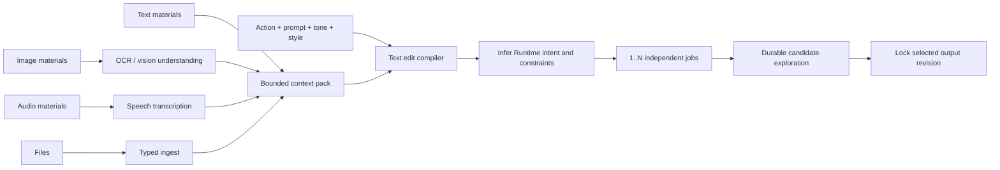

编译器必须保存每个中间派生的来源和失败状态：语音转录失败不能当作“没有语音”；图片理解不可用时
不能悄悄丢弃图片。当前只有直接文本路径时，UI 可以执行 text-only，其他素材组合必须明确显示
pipeline unavailable，不能把未消费的输入仍显示成已参与生成。

### 11.5 Graph UI

- Project 打开后先恢复上次 Scene；Scene Operator Graph 是创作编排主画布。
- Source 与 Output 必须视觉、交互和数据合同上区别于可编辑 Operator。
- 一个 Scene 可有多个命名 Output；一个 Operator 可有多个类型化输出端口。
- GraphComponent 以折叠节点出现，可显式进入其内部图，而不是复制粘贴展开内容。
- 单击节点负责选择和检查，双击或显式打开才进入节点专属 Workspace。
- 默认显示按创作事件聚合的短历史，不显示几十条执行步骤。
- 可切换 `History / Branches / Dependencies` 三种视图。
- 主线默认只显示 accepted revisions。
- Exploration 以一组堆叠候选显示，展开后才看全部。
- Execution details 是节点的诊断面板，不是主画布。
- 允许从任一历史 Revision 开始新分支，但不覆盖已有下游。

### 11.6 Compare 与 Accept

Compare 是核心能力，不是附加功能：

- 图像：side-by-side、wipe、闪烁、preserved-region overlay；
- 文本：semantic diff + literal diff；
- 音频：loudness-matched A/B、同步播放；
- 视频：同步 playhead、split view；
- 显示每个 Constraint 的 verified/unverified/failed；
- Accept 前明确显示云费用、合成内容和不可完全重现提示。

### 11.7 产品概念图

以下概念图用于验证产品心智模型和布局方向，不是最终视觉规范。

#### 主工作界面

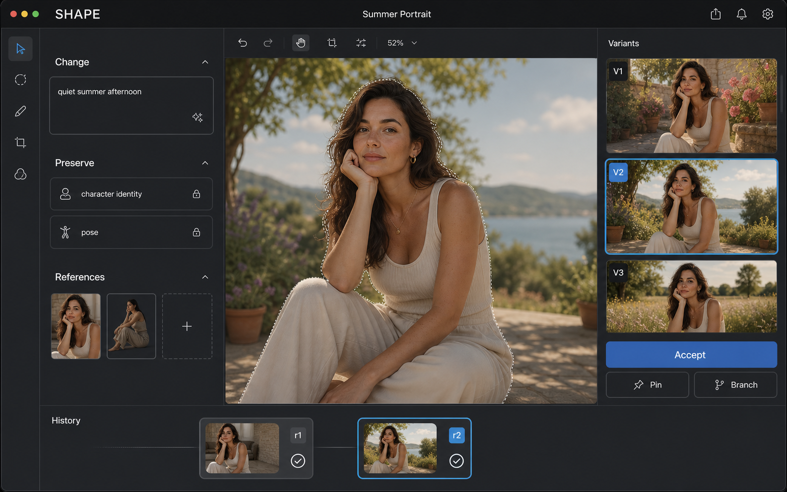

这张图强调：Change 与 Preserve 分离、References 可见、候选在右侧比较、Accept 是主动作，底部 History 只保留少量已接受 Revision。它刻意不展示模型和底层执行节点。

#### Preserve → Change → Explore → Accept

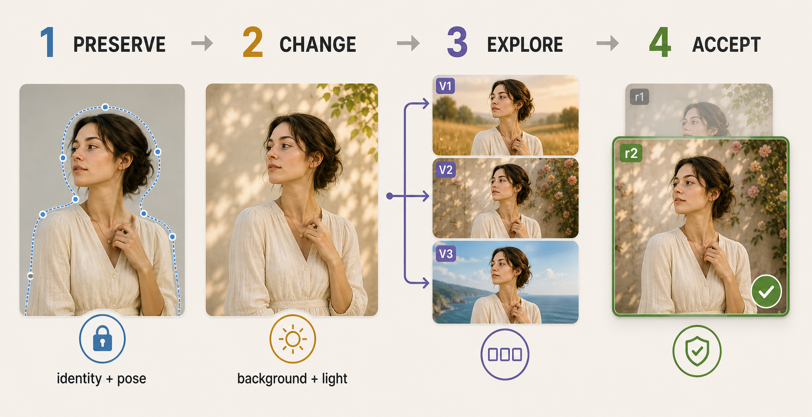

这张图把 Shape 与普通“生成按钮”的差异压缩成一个视觉循环：先锁定身份与姿势，只改变背景与光线，再从候选中接受一个新 Revision，同时保留旧 Revision。

#### Shape 软件生态

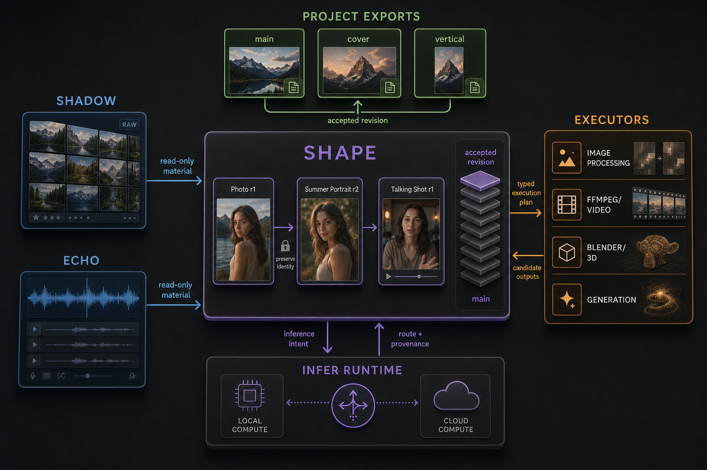

这张图强调四条边界：Shadow/Echo 只提供 read-only material；Shape 保存语义创作历史与 accepted revision；Infer Runtime 只接收 inference intent 并返回 route/provenance；外部 Executors 接收 typed execution plan 并返回 candidate outputs。

---

## 12. 三个端到端用例

### 12.1 Shadow 照片创意改造

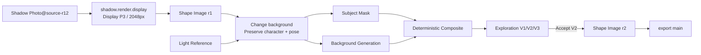

Scene Operator Graph 只显示 `Source(Image r1) → Change background → Output(main)`。若 Composite
本身是用户希望复用、连接或调整的创作模块，它也是 Operator；模型预处理、采样、mask 生成
和渲染步骤仍属于 Execution Graph。

### 12.2 Echo 录音生成 talking shot

用户看到：

```text
[Character]
+ [Echo Dialogue]
→ Talking Shot
→ [8s Video]
```

内部可能执行：

```text
echo.render.pcm
→ audio.align（Infer Runtime）
→ image preprocess
→ video.generate 或 lipsync provider
→ FFmpeg resample/mux
→ output validation
```

Echo Original、文字证据和声音身份不被修改。生成视频明确标记 synthetic/derived。

### 12.3 跨项目角色依赖

```text
Character Project
  export main@r7
       ↓ Watch import
Picture Book Project
  Page 1 / Page 2 / Cover
```

角色项目发布 r8 后，绘本项目只收到 pending update。Shape 生成封面和页面的影响预览；用户接受后，绘本的相关 Artifact 才产生新 Revision。

---

## 13. 存储、事务与缓存

### 13.1 最小持久化模型

建议 SQLite owner：

```text
projects
artifacts
artifact_revisions
artifact_contents
components
transformations
constraints
reference_bindings
explorations
candidates
execution_receipts
imports
exports
dependency_locks
accepted_heads
```

Blob、媒体和大型 JSON 进入 CAS；SQLite 只存 digest、长度、media type、schema 和逻辑关系。

### 13.2 原子 Commit

```text
1. Executor 写入 job-private temporary output
2. 校验格式、长度、像素/时长、输出合同
3. 计算 BLAKE3 digest
4. 原子 publish 到 CAS
5. SQLite transaction 写 Receipt、Candidate/Revision、graph edge、accepted head
6. 事务成功后发布 UI event
7. 失败时清理未引用临时对象；不留下半提交 Revision
```

### 13.3 Cache Key

确定性执行的 cache key 至少包含：

```text
capability contract revision
implementation/build identity
input revision digests
normalized parameters
constraint/reference digests
output/render contract
platform-sensitive identity（必要时）
```

AI 生成默认不因“Prompt 看起来一样”就复用结果；只有 provider/seed/build/完整输入合同允许时才 Exact cache。

### 13.4 GC

- Accepted Revision、Pinned Candidate、Published Export、Pinned/Vendored Import 永不自动回收。
- Ephemeral preview 可随时回收。
- 未固定 Exploration 按项目策略保留，例如最近 N 次或磁盘上限；UI 显示策略。
- GC 采用 mark-and-sweep，从所有 durable roots 遍历 CAS。
- 删除只先产生 tombstone；真正移除大对象前提供可恢复窗口。

---

## 14. 色彩、时间与媒体合同

跨媒体系统失败往往不是因为缺模型，而是因为隐式色彩/时间约定。

### 14.1 Image Contract

每个 raster 必须声明：

```text
width / height
pixel format / bit depth
alpha mode
orientation
color primaries
transfer function
ICC/OCIO identity
scene-referred or display-referred
premultiplication
```

Shadow RAW → Shape 默认使用明确的 rendered RGB contract；Shape 不把 display proxy 误称为 RAW 等价物。

### 14.2 Audio Contract

延续 Echo：未来 composition/render 内核建议使用 float32、48 kHz、channel-preserving；设备播放
或最终文件再适配。已经落地的首个 `audio.clip` 合同不伪装成该未来内核：它保存并重开精确
PCM S16 LE WAV、真实 sample rate/channel/frame count 与
`synthetic_speech|recorded_source|synthetic_sound|transformed_audio` 来源披露。接受时必须从精确
bytes 重新推导合同，不能相信执行器声明。

当前桌面试听仅为“选中一个已接受音频或候选时”按需取得 exact WAV，并由独立内存播放 owner
持有；普通 project snapshot/QML 不携带音频 bytes。它不是未来 float32/48 kHz composition
engine，也不承诺 waveform、mix、effect 或 final render parity。

### 14.3 Video/Timeline Contract

必须显式保存：

```text
rational frame rate
time base
start timecode
audio sample rate
pixel aspect
field order
color metadata
HDR mastering metadata（如有）
```

不要用浮点秒作为唯一持久时间。M4 用 OTIO 表达可交换剪辑语义，用 MLT/FFmpeg 负责执行；二者不能互相替代。

### 14.4 Preview 与 Final

- Preview 使用降低分辨率/质量的 Render Contract，但必须披露差异。
- Final 不得无提示换 provider、model build、color transform 或 effect implementation。
- 如果 Preview executor 与 Final executor 不同，Accept 前至少跑一次代表性 final-quality validation。

---

## 15. 安全、隐私与信任

### 15.1 数据分类

建议沿用并扩展现有体系：

```text
Public
Personal
SensitiveBiometric
RestrictedSource       // RAW、未公开商业素材、受合同限制内容
```

每个输入、Reference、Derived Artifact 和 Export 都有分类；一个 Transformation 的有效分类至少是所有输入的上界。

### 15.2 云外发

云外发必须同时通过：

1. Shape App 的 Infer Runtime/cloud provider ACL；
2. Project policy；
3. Asset/Reference privacy class；
4. capability/provider manifest；
5. 本次用户同意或已保存的明确规则；
6. 实际 outbound representation receipt。

外发对象先 materialize、剥离 metadata、规范化并计算 digest；授权针对实际上传字节，而不是源文件路径。

### 15.3 生物特征与声音克隆

- Face embedding 只作为本地、可重建、受限证据；不进入通用搜索日志或云端。
- Voice clone 必须记录授权主体、同意范围、来源录音和输出用途；未获得明确同意时 capability 不可用。
- 角色一致性可以使用非生物的 creative identity reference；不要默认把它等同真人身份。

### 15.4 Planner 安全

- LLM 只产生受 schema 约束的 proposal，不产生任意命令。
- 未知 transformation/capability/parameter 直接拒绝。
- 文件路径通过 materialization handle 传递，不让模型构造本机路径。
- 任何外部写入、发布、付费请求和云外发都经过显式 policy gate。

---

## 16. 可靠性、性能与可观测性

### 16.1 基本可靠性原则

- UI 与 Project 浏览永远不依赖 Infer Runtime 或生成服务在线。
- 长任务可取消；若执行器不可中断，取消意味着丢弃迟到结果且不能发布。
- 每个 Job 只有一个终态；重试产生 Attempt，不覆盖历史。
- fallback 不能突破 privacy、placement、quality floor、cost 或 output contract。
- 外部执行器崩溃不损坏 Project；只留下失败 Receipt 和可清理 temporary output。
- 项目打开时先恢复已提交事务，再 reconcile CAS orphan 和 interrupted Job。

### 16.2 暂定体验预算

这些是工程目标，不是当前性能事实：

| 交互 | 目标 |
| --- | --- |
| 输入/选择反馈 | 同一帧或不超过 100 ms 的可见反馈 |
| 确定性 2K 图像局部预览 | 目标 p95 < 200 ms；超出时渐进分辨率 |
| Commit | UI 不阻塞；先显示已提交元数据，再渐进生成高质量 preview |
| AI Job | 100 ms 内显示 admitted/queued/running 状态，不伪造百分比 |
| Project reopen | 不等待模型加载；先恢复 accepted artifacts 和 previews |

### 16.3 可观测性

Shape 记录：

- Transformation → ExecutionPlan → Job/Attempt → Candidate → Revision 的全链路 ID；
- cache hit/miss、preview/final render；
- executor/version/build、资源与费用；
- constraint validation 结果；
- failure domain 和稳定错误码；
- 不含敏感 payload 的审计事件。

用户看到创作语言；诊断界面才显示底层路线。

---

## 17. 测试与评估

### 17.1 Domain tests

- Revision 不可变；
- accepted head 移动不改历史；
- Import DAG 无环；
- Pinned/Watch/Vendored 语义；
- GC 不回收任何 durable root；
- Candidate 晋升原子性；
- Component ref 在内容变更时正确保留或失效；
- schema migration 与旧项目只读打开。

### 17.2 Adapter contract tests

每个 Executor 用 fake implementation 覆盖：

- probe/version mismatch；
- invalid input/output；
- cancel before start / queued / running / validating；
- timeout、crash、malformed progress、oversized output；
- retry/fallback 边界；
- actual implementation 与声明不一致；
- cloud endpoint 零触达断言；
- sandbox/path traversal/script injection。

### 17.3 Render tests

- 确定性输出使用 exact hash 或定义的 numerical tolerance；
- 图片使用像素/色差/结构比较，不用单一感知分数冒充正确性；
- 音频验证 loudness、peak、时长、sample alignment；
- 视频验证 frame/timebase、音画同步、色彩 metadata；
- Preview 与 Final 用明确允许差异的 golden cases。

### 17.4 Planner evals

建立小而高质量的真实创作语句集，验证：

- Change/Preserve/Reference 是否拆分正确；
- 是否擅自扩大修改范围；
- Hard/Preferred Constraint 是否合理；
- 缺少必要信息时是否停在 proposal 而非执行；
- 是否选到输入/输出合同兼容的 capability；
- 是否在 Scene Operator Graph 中保留简洁、可连接的创作意义。

Planner eval 不能只测 JSON 合法；必须测语义是否忠实。

### 17.5 纵向验收

M1 至少覆盖：

1. 文件图片 + deterministic edit；
2. Shadow pinned import；
3. AI generation/edit with 3 variants；
4. Hard preserve region validation；
5. Accept/undo/branch；
6. Project export/import；
7. Runtime 离线仍能打开和导出；
8. Executor 版本缺失时仍可查看 accepted result；
9. 云外发被拒绝时零网络触达；
10. 崩溃恢复后没有半提交 Revision 或 orphan dependency。

---

## 18. 分阶段路线图

路线图以退出门槛推进，不用日期替代完成定义。

### F0：决策与工程基线

目标：冻结足以开始 M0 的边界。

工作包：

- 决定 Shape 许可证与 Shadow/Echo 链接策略；
- 建立 Rust workspace、Qt shell、SQLite/CAS 基线；
- 固定 schema revision 规则和 error taxonomy；
- 定义 Scene/SceneRevision/OperatorGraph 与 Artifact/Revision/Content/Transformation/Constraint 的 v0 合同；
- 定义 Executor fake contract 和 crash/cancel tests；
- 与 Shadow/Echo owner 对齐 Suite Asset Contract 草案；
- 与 Infer Runtime owner 对齐 `shape` App 最小 ACL，但不把未冻结 multimodal 当依赖。

退出门槛：

- 核心对象不再存在“Scene、Operator、Artifact、Revision 谁是容器或值”的歧义；
- 能创建、保存、关闭、重开一个无媒体的 Project；
- 原子 CAS publish 和故障恢复通过；
- fake executor 可产生 Candidate、Accept 和失败 Receipt。

### M0：Creative Document Model Lab

范围：Image + Text，无真实生成模型也能完成。

工作包：

- `text.document`、`image.raster`、`image.composite`；
- 多 Scene、Source/Operator/Output 类型化 DAG 与一个真实多输出 Operator；
- GraphComponent 封装、版本固定与实例展开；
- stable component IDs；
- Draft/Preview/Commit；
- deterministic crop/resize/transform/text/composite；`basic color` 保留 Shape 语义，首选通过
  Shadow 外部编辑 Adapter 执行，不把复制一套调色管线作为 M0 门槛；
- Exploration/Candidate/Accept/Pin/Branch；
- Semantic History；
- file import 与 file serialization；
- project export/import 的 Pinned 策略。

退出门槛：

- 真实用户可以连续完成 20 次编辑而 Scene Graph 仍可理解；
- 至少两个 Scene 可并行演进，并通过命名 Output 或 pinned Component 复用而不共享草稿状态；
- slider/scrub 不产生 Revision；
- 历史回退、分支、重开一致；
- 没有 AI 服务时产品仍完整可用。

### M1：Image + Text AI 纵向切片

范围：验证 Shape 的核心产品承诺。

工作包：

- Intent proposal：Change/Preserve/Reference；
- Infer Runtime `language.respond` 与可用的 image understanding adapter；
- 一个受控 Diffusers generation/edit worker；
- 可选 ComfyUI advanced bridge；
- subject mask adapter（先用已审计实现；Shadow SAM 路线稳定后可复用）；
- 3–4 个候选与 Compare；
- constraint evidence；
- Shadow `resolve/render` 最小只读 Adapter；
- execution receipts、费用和 synthetic disclosure；
- `export main`。

退出门槛：

- 完成第 1.3 节定义的完整演示；
- 用户不接触底层 workflow 也能完成结果；
- Cloud disabled 时零图片外发；
- 每个 accepted AI result 都有 materialized output 与 provenance；
- 外部生成器缺失时历史仍可打开。

### M2：Projects Compose / Creative Library

工作包：

- Watch/Vendored imports；
- pending dependency update 与影响预览；
- Creative Library 基于 Project Exports；
- bundle、角色、风格、场景等复用模式；
- Krita/Inkscape round-trip；
- GEGL/长尾图像能力按真实需求接入。

退出门槛：

- 一个 Character Project 同时被两个项目消费；
- 上游更新不静默改变下游；
- 离线上游、删除入口、vendor、fork 都有确定行为；
- 外部编辑往返形成新 Revision 且能检测冲突。

### M3：Audio 与 Echo

工作包：

- Echo Suite Asset API；
- `audio.composition`；
- FFmpeg/Echo render adapter；
- trim/fade/gain/pan/basic mix；
- ASR/align 与 preset TTS 通过 Infer Runtime；Voice Design/Clone 只有在独立 consent、授权和
  provider 合同完成后才进入可执行范围；
- 声音 consent 与 derived disclosure；
- Image + Audio cross-media composition。

退出门槛：

- Echo Original 不变；
- 录音可 pinned import、剪切、混合、生成旁白并导出；
- audio preview 与 final 的时间/响度合同稳定；
- Runtime 不在线时仍可播放已接受结果。

### M4：Video / Storyboard

工作包：

- `storyboard`、`video.sequence`；
- rational time model；
- MLT render adapter + FFmpeg finalization；
- OTIO import/export；
- subtitle、transition、simple keyframe；
- image/audio/video generation providers；
- Kdenlive round-trip。

退出门槛：

- 由 Image + Echo Audio 生成短视频并保持简单 Scene Operator Graph；
- OTIO 往返剪辑结构，已知丢失字段明确报告；
- 音画同步、色彩、frame rate 和 final render 可验证；
- 生成视频 pipeline 不泄漏到主图。

### M5：3D、复杂外部工具与生态

工作包：

- Blender background adapter；
- opaque external document revision；
- 3D render contract；
- 外部可信 executor 安装/探测；
- 远程可信节点与大型生成 Job；
- capability package/adapter SDK（只在至少三种外部实现重复后提炼）。

退出门槛：

- 不可信 `.blend`/脚本不能越过 sandbox；
- Blender 结果可物化、可追踪、可重开；
- 外部能力离线不破坏 Project；
- SDK 建立在真实重复合同上，不是预先设计的抽象市场。

### 暂缓

- 实时多人协作；
- 通用节点编辑器；
- 模型训练/LoRA 管理 UI；
- 完整 DAW/NLE/3D 内建替代；
- 自动把 Shape 作品写回 Moment；
- 未经影响预览的 live dependency auto-update；
- 任意第三方插件在 Shape 进程内执行。

---

## 19. 具体问题与方案

| 问题 | 失败方式 | 本方案 |
| --- | --- | --- |
| 节点粒度 | 只放文件太粗；图层与物理步骤全进主图又爆炸 | Scene Operator + ArtifactRevision value + 内部 ArtifactContent 三层模型 |
| Transformer 含义混乱 | 创作意图、参数、模型执行挤在一起 | Transformation / ExecutionPlan / ExecutionReceipt 分离 |
| Prompt 无法表达“不许改” | AI 做对了变化却破坏主体 | Constraint 一等化，Hard/Preferred/Advisory + evidence |
| Variant 污染历史 | 每次 8 张图让 Graph 不可读 | Exploration sidecar；Accept/Pin/Branch 才晋升 |
| Live dependency 破坏作品 | 上游更新导致下游静默变化 | Watch 只提示 pending update，接受后产生新 Revision |
| 模型升级后无法复现 | 同 Prompt 得到不同图 | 保存 build/seed/workflow/digest；区分三种重现等级；保存 materialized accepted output |
| 外部软件没有稳定 API | 自动化脆弱、格式丢失 | Embedded/Headless/Round-trip 分级；opaque external document + explicit loss report |
| Shape 与 Infer Runtime 重叠 | 两套路由、两套资源管理 | Infer 负责推理控制；Shape 负责创作编排；新 typed family 由多 consumer/资源需求触发 |
| Shape 与 Shadow/Echo 重叠 | 重做 RAW/音频库；数据事实漂移 | 只读 Suite API + Shape-owned derived artifact + explicit publish back |
| Graph 变成 ComfyUI | 用户管理 implementation detail | Scene/Content/Execution 三图隔离，主图只显示创作级 Operator 与类型化接口 |
| Preview 与 Final 不一致 | 用户接受的不是最终结果 | 明确 render contract；final validation；禁止无提示换执行路线 |
| 云端隐私 | RAW、脸、声音被隐式上传 | 多重 ACL + outbound receipt + zero-touch tests |
| 第三方许可 | 代码许可被误当模型/数据许可 | 四类许可事实分离、Build 级台账、分发门 |
| 外部进程破坏系统 | 任意脚本、路径穿越、输出炸弹 | 独立工作目录、禁网、模板脚本、资源上限、严格输出校验 |
| 项目无限膨胀 | Preview/variant 缓存不受控 | durable roots + retention + mark-and-sweep GC |

---

## 20. 仍需立项前确认的决策

以下不阻止概念成立，但会影响工程边界：

| 决策 | 推荐默认 | 何时必须决定 |
| --- | --- | --- |
| Shape 许可证 | 已冻结为 MIT；Shadow GPL 内核走独立进程/API 边界，组合分发另行法律评审 | 已关闭（2026-08-10） |
| Project portable 策略 | Project bundle 自包含 metadata；大源资产默认引用，Export/accepted output 可选择 vendor | F0 |
| M1 本地生成实现 | 受控 Diffusers worker 为默认；ComfyUI 为用户安装的高级 bridge | M1 开始前 |
| M1 subject mask | 选一个已审计实现；Shadow SAM Adapter 稳定后替换/并列 | M1 开始前 |
| Shape 是否允许默认 cloud | 默认关闭；每 Project/Capability 显式开启 | F0 |
| Shadow/Echo Suite API 是否共享协议 crate | 先共享信封和测试，不强行共享媒体 request schema | F0/M1 |
| Content schema 扩展方式 | 每媒体独立 versioned schema，共享 Revision envelope | M0 |
| Scene Graph v0 | 类型化 DAG；Source/Operator/Output 分离；允许多输出；循环等真实反馈用例后再设计 | 已冻结方向（2026-08-11） |
| GraphComponent 更新 | 实例默认 pinned 定义版本；更新需要显式 review/accept | M0 |
| AI 候选默认保留期 | 项目可配置；默认保留最近 Exploration，Accept/Pin 永久 | M1 |
| 外部编辑冲突 | checkout snapshot；返回时若基线已变化，要求 rebase/branch，不覆盖 | M2 |

---

## 21. 风险清单

| 风险 | 严重度 | 缓解 |
| --- | --- | --- |
| 文档模型漂亮但交互繁重 | 高 | M0 用真实连续编辑测试；默认自动插入兼容节点，同时允许大型项目显式接线和封装 Component |
| ArtifactContent 过早抽象成万能树 | 高 | Image/Text 独立 schema；等 Audio/Video 出现真实重复再抽公共层 |
| AI Planner 擅自扩大修改 | 高 | Proposal review、Hard scope、typed capability、constraint validation |
| 依赖外部工具导致不可复现 | 高 | 固定版本、Receipt、materialized accepted result、adapter conformance |
| Shadow/Echo API 尚未准备好 | 中高 | M1 保留普通文件导入；Suite API 作为独立工作包，不直接读内部 DB |
| Infer Runtime 合同正在演进 | 中高 | manifest/probe gating；只依赖已冻结 contract；实验能力可禁用 |
| Apple Silicon 本地生成性能不足 | 中 | progressive preview、可选 cloud、用户 GPU/远程节点、M1 不把某一模型锁成产品定义 |
| 第三方许可证锁死分发 | 高 | Shape 已冻结 MIT；GPL 组件保持外部进程边界；建立 Build 级法律台账 |
| CAS 占用失控 | 中 | retention、quota、GC dry-run、项目容量说明 |
| “The result is the interface”退化成聊天框 | 高 | Workspace、selection、compare、constraints 与 direct manipulation 同等重要 |

---

## 22. 推荐的首批工程工作包

建议按以下顺序开工：

1. `shape-domain`：Project、Scene Operator Graph、Artifact、Revision、Transformation、Constraint、Reference、Import/Export 纯合同与不变量。
2. `shape-store`：SQLite、CAS、原子 commit、GC roots、migration。
3. `shape-execution`：fake Executor、Job/Attempt、cancel、Receipt、output validation。
4. `shape-image-content`：Raster/Composite/Layer/Mask/Component schema。
5. `shape-text-content`：Text blocks、selection、diff。
6. `shape-app`：DraftSession、Preview、Accept、Undo/Branch、Publish services。
7. `apps/desktop`：Qt/QML shell、Scene Graph、node workspace、Intent proposal、Canvas/Text workspace、Compare、History。
8. `shape-executor-builtin`：crop/resize/transform/text/composite；创意调色默认不复制 Shadow。
9. `shape-infer-client`：独立 App contract probe、Responses/typed vision adapter、provenance mapping。
10. `shape-suite-shadow`：只在 Suite Asset Contract 确定后接入。
11. `shape-executor-diffusers`：独立 worker、固定 pipeline templates、模型 manifest。
12. `shape-executor-comfy`：advanced optional bridge，不进入 M1 默认依赖。

目录只是责任建议，不应在没有代码增长证据前机械拆成大量 crate。前三个 owner 应保持非常小而稳定。

---

## 23. M1 完成定义

> 2026-08-11 实现基线：`shape-domain::operator_graph` 已有 Source/Operator/Output、类型化端口、
> 多输出能力与 DAG 校验；`Scene/SceneRevision` 已拥有独立身份、命名 Output、不可变图修订和
> expected-head CAS 持久化，两个 Scene 的独立演进与重开已通过核心合同测试。桌面端目前仍把
> 现有 Artifact 接受历史兼容投影为单输出 Scene，并以 Scene Graph 为主视图；尚未接入持久化
> Scene 图编辑，GraphComponent 也未完成。文件导入的 `image.raster` 已冻结首版显式色彩/像素合同，并完成
> PNG/JPEG → 确定性 Crop/Resize/Transform/Blur/Drop Shadow/Unsharp Mask → Candidate → Compare →
> Accept → Reopen 的桌面纵向切片。已实现算法的状态、边界和接入入口统一记录在
> [`raster/README.md`](crates/shape-execution/src/raster/README.md)，数值细节以源码和黄金测试为准。
> Resize 的版本化草稿保存尺寸、纵横比策略和采样核，并在执行前从 Project 权威回读。它验证了
> “确定性图像编辑复用同一接受心智模型”，但尚不代表 M0/M1 完成。零输入
> `image.generate` 已有可重开的桌面 Source Draft、综合意图面板、独立控制器与 Candidate/Accept
> 回路；真实云端生成仍等待 Infer App ACL 授权。有素材生成、Shadow 来源、Composite、通用
> Preserve/Reference 与 Export 等门槛仍保持未勾选。

只有以下全部成立，才能说 Shape 的第一阶段成立：

- [ ] 用户能从文件和 Shadow 导入图像，且来源修订版明确。
- [ ] 用户能选择作品或组件，分别编辑 Change、Preserve、References。
- [ ] 确定性编辑和 AI 编辑共享 Accept/Revision 心智模型。
- [ ] 至少一个多输入 Transformation 和一个非确定性 Transformation 被真实验证。
- [ ] 至少两个独立 Scene、一个多输出 Operator 和一个 pinned GraphComponent 被真实验证。
- [ ] 候选不会默认污染已接受的 Scene Operator Graph。
- [ ] Accepted Revision 不可变，历史、分支、重开一致。
- [ ] Execution Graph 默认不可见，但每个结果可追踪到执行路线。
- [ ] Infer Runtime 离线、生成执行器缺失时，已接受作品仍可打开与导出。
- [ ] Cloud disabled 时测试证明像素零外发。
- [ ] Export 是可被另一个 Project pinned import 的接口，不只是导出 PNG 按钮。
- [ ] 用户能理解创作 Operator Graph，但不需要理解模型、sampler 或执行器节点图即可完成核心演示。

---

## 24. 研究依据与外部项目链接

本规划对外部执行器的判断基于其官方文档或官方仓库；版本和许可在实际捆绑前仍需以精确 revision 重新审计。

- [FFmpeg / libavfilter 文档](https://ffmpeg.org/ffmpeg-filters.html)；[FFmpeg License](https://ffmpeg.org/doxygen/trunk/md_LICENSE.html)
- [libvips 官方站点](https://www.libvips.org/)
- [OpenImageIO 官方仓库](https://github.com/AcademySoftwareFoundation/OpenImageIO)
- [OpenColorIO 官方仓库](https://github.com/AcademySoftwareFoundation/OpenColorIO)
- [GEGL command line](https://gegl.org/commandline.html)
- [MLT Framework](https://www.mltframework.org/docs/)；[`melt` 文档](https://www.mltframework.org/docs/melt/)
- [OpenTimelineIO 文档](https://opentimelineio.readthedocs.io/en/latest/)
- [Kdenlive OTIO import/export](https://docs.kdenlive.org/en/user_interface/menu/file_menu.html)
- [Blender command line / background rendering](https://docs.blender.org/manual/en/latest/advanced/command_line/arguments.html)
- [Krita command line export](https://docs.krita.org/en/reference_manual/linux_command_line.html)
- [Inkscape command line](https://wiki.inkscape.org/wiki/Using_the_Command_Line)
- [ComfyUI Server API](https://docs.comfy.org/development/comfyui-server/comms_overview)；[ComfyUI 官方仓库](https://github.com/comfy-org/ComfyUI)
- [Hugging Face Diffusers 官方仓库](https://github.com/huggingface/diffusers)
- [InvokeAI 官方仓库](https://github.com/invoke-ai/InvokeAI)

---

## 25. 最终结论

Shape 最值得造的不是“万能编辑器”，也不是“自然语言版 ComfyUI”，而是一种新的 creative document model：

```text
Artifact identity
+ immutable accepted revisions
+ structured internal content
+ semantic transformations
+ explicit constraints and references
+ exploration before acceptance
+ execution-independent provenance
+ composable project exports
```

这套模型首先在 Image + Text 的真实连续创作中成立；随后 preset-only speech 已用同一个
Candidate/Accept、immutable Revision、source-head CAS、provenance 与 selected-only audition
边界证明 Audio 可以沿稳定方向加入，但尚不代表完整音频工作台完成。Video、3D、Shadow/Echo
深度互操作和更多外部软件
仍必须沿相同边界逐步验证，不能因已有执行器而跳过产品合同。

因此实际开工顺序应当始终是：

> **先证明 Preserve → Change → Explore → Accept 能形成自然、可靠的创作循环，再扩展执行器和媒体种类。**
