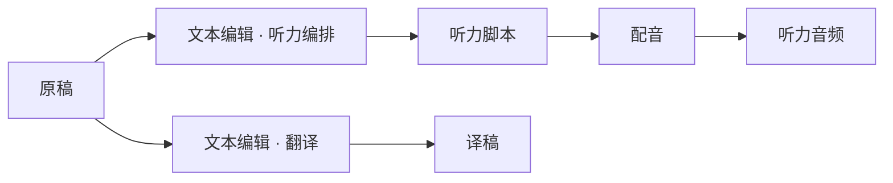

# 节点与文本工作流

本版的新建文本与配音使用以下规则。AI 是执行方式，不是节点类别。

| 节点 | 必需输入 | 输出 | 职责 |
| --- | --- | --- | --- |
| 原始素材 Source | 无 | 已保存的素材版本 | 只读提供材料；不改稿、不执行规则 |
| 文本创作 `text.create` | 无 | 独立文本 | 从需求或手写开始，可附参考内容；选择输出格式与写作预设 |
| 文本编辑 `text.edit` | 一份已采用原稿 | 独立文本 | 改写、翻译、摘要、润色、扩写、大纲、编排脚本；保留原稿与明确的输入版本 |
| 图片生成 `image.generate` | 无 | 图片候选 | 根据描述和期望画幅，通过 Infer 调用 Codex Luna；显式采用后保存 |
| 配音 `audio.speech_synthesize` | 一份已采用文本 | 固定身份的音频输出 | 读取文本格式，配置音色、语速与音效，合成、试听、导出 |
| 命名输出 Output | 对应节点的结果 | 可供其他节点引用的已采用版本 | 显示作品；候选必须显式采用后才能成为下游输入 |

新建文本直接进入统一工作区，先选择普通文本或配音脚本，再描述需求或手写。
听力练习、多人对话是可选写作示例，使用同一种配音脚本格式；示例只指导起稿，不改变脚本校验或配音执行。规则与示例可在格式面板中查看和复制。
语气、读者与文风是可展开的创作设置；个人预设的含义复制进节点，不依赖后来修改的个人库。

对一份原稿添加文本编辑会创建独立输出。再次添加编辑节点可以建立另一个分支；打开已有节点继续修改它。
没有已采用原稿时不提供文本编辑动作。原稿更新后，已有编辑和配音保持固定输入版本，
关系图用标有“较早版本”的虚线表示该版本引用，不重复绘制一张原稿卡；
用户点击“使用最新原稿”后才切换输入。旧候选不能越过输入版本、输出版本或规则变化的检查。

普通文本与配音脚本的解释由 `TextDocumentContract` 随不可变 Revision 保存。
配音脚本格式版本为 `20260922.2`，具体语法见 [脚本规则](SPEECH_SCRIPT.md)。
写作示例只保存在可修改的起稿配置中；语法决定指令如何解释，配音配置决定角色使用什么声音。旧草稿中作为格式保存的听力、口播、对话会按配音脚本与相应示例读取。
配音根据已采用文本的契约识别格式，不靠残留的编辑草稿或额外的解析模式开关。
删除草稿配置或只传递正式文稿不会丢失格式身份；项目保存原稿的确切字节及其 BLAKE3 内容身份。

节点身份、输入引用和配置属于可修改的工作图；生成记录和已采用文本属于不可变历史。
每个文本或配音节点预留自己的 Output Artifact，反复运行和采用不增加节点、不替换原稿。
采用在同一个存储事务中核验原稿版本、输出版本、执行时的节点配置，并更新输出版本与工作图锚点。

当前桌面按命名输出组织工作区，项目关系图通过持久化的输入绑定显示分支。
手写创建的原稿在关系图中显示为一张文本素材卡：创建动作与其命名输出是同一份内容，
无需再画一张独立的结果卡。AI 创作仍显示执行步骤及其结果。沿唯一已有连线点击端口的 `+`
会打开下游步骤；没有下游时才打开节点库。节点库仍可显式添加另一条分支。
未采用的草稿节点可以移除，包括已经画在关系图中的配音步骤；
移除时连同它的空输出一并删除。已采用的版本属于不可变历史，
不能以“丢弃草稿”清除。
任意端口重连、多素材文本编译、用户保存画布坐标和通用多输出组件尚未开放。
已有图像工具继续使用各自的图像编辑契约。本次没有把旧文本草稿迁移成新节点的兼容路径。

## 制作脚本的内部编排

制作设置、角色表、片段和播放控制属于脚本文档内部内容，不自动增加 Scene 画布节点。
AI 写作设置编译成稿内声明与控制；采用前按相同设置校验，手写稿以自己的声明为准。
重复块保存一次正文，合成计划引用首次录音；配音只为独立语句请求模型，复播片段不创建新的语音请求。
整体及角色朗读语气通过独立模型指令执行，区别于文本编辑的文章文风。
命名角色必须显式选声，同名提示音复用定义或绑定的项目资源；未完成绑定时不能生成。
完整文稿、音色绑定、控制计划和音频片段来源共同决定录音结果，重复 PCM 在采用时再次校验。

## 常用节点库

选中一份已采用的文本后，节点库提供翻译、摘要、润色、扩写、大纲和脚本改编。
这些入口是 `text.edit` 的任务预设，任务随节点配置保存；可以在编辑面板中调整任务、要求和输出格式。
每次插入都创建一个独立输出，原文可继续用于其他分支。翻译默认转为简体中文，可在要求中指定其他目标语言。
没有原稿时可使用文本创作节点，描述需要生成的文章、提纲或脚本。

图片生成在新建内容和节点库中均可进入。可先创建空图片草稿，再填写描述；
提供方形 1:1、横向 3:2、纵向 2:3 的期望画幅。
当前 Infer 图片合同只支持根据文字生成单张图片，不支持参考图或图片编辑。
Shape 默认指定 `codex_gpt_5_6_luna`，可在设置中明确选择 GPT-6 Luna 或 Sol；不回退到其他模型。模型未获授权或未就绪时会保留草稿并报告失败。
结果必须是通过格式与资源上限检查的 PNG，并经过候选检查和显式采用。

文字编辑框有固定视口和内部滚动条，长文不会把页面撑高；写作表单和配音两栏分别滚动。
按钮按内容定宽。脚本的完整阅读视图仍可以通过外层滚动查看全部播放顺序。

生图的画幅是生成意图，候选使用模型返回的原始像素尺寸，不会因为尺寸偏差丢弃有效图片，
也不自动裁切或重采样。预览显示实际尺寸；需要精确尺寸时，采用后连接图片编辑节点。
